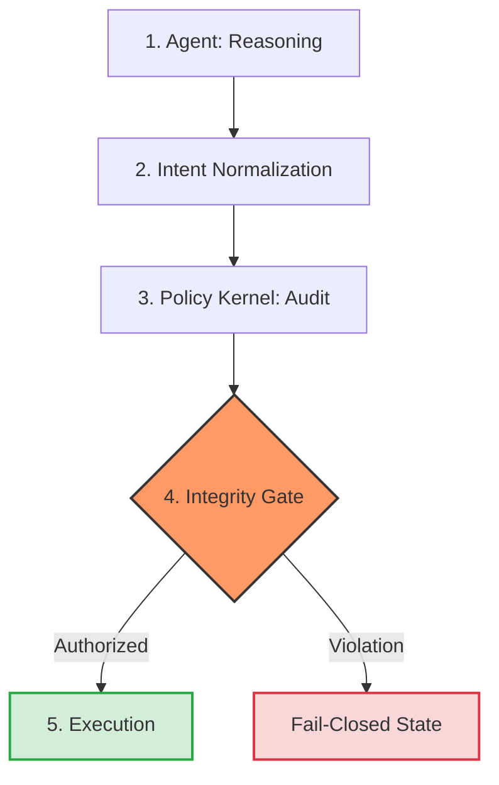

# CDA: Cognitive Decision Architecture
### Deterministic Governance & Forensic Auditing for AI Agents

CDA is a high-integrity framework designed to bridge the gap between autonomous AI Agent intents and corporate business rules.

## ⚖️ The Sovereignty Invariant
Every decision within the CDA framework follows a mathematical law of integrity:

$$D(I) = R(I) \cdot \Sigma$$

Where:
- **D(I):** Final Execution Decision.
- **R(I):** Policy Rule evaluation (Boolean/Deterministic).
- **Σ (Sigma Seal):** Cryptographic validation via **PASETO v4**.

## ✨ Key Features
- **Deterministic Governance:** Policies enforced via hard-coded rules, preventing AI "hallucinations".
- **Cryptographic Accountability:** Uses **PASETO v4** tokens for non-repudiation.
- **Forensic Policy Hashing:** Every decision is bound to a specific, hashed version of the policy Kernel to prevent governance drift.
- **Zero-Latency Enforcement:** Policy state is sealed within the decision envelope, bypassing database bottlenecks at the execution boundary.

## 🏗 Architecture
1. **Kernel (The Auditor):** Evaluates intents against trusted policies using immutable versioning.
2. **Gate (The Enforcer):** Deterministically validates tokens and finalizes execution (Fail-closed by design).
3. **Ledger (The Forensic Record):** Provides a tamper-evident audit trail with SHA-256 forensic hashes.

## 🔄 System Execution Flow
The CDA operates as a five-stage pipeline to ensure that no AI intent reaches execution without deterministic validation.



⚖️ Regulatory Alignment
CDA is architected to satisfy 2026 compliance standards by shifting governance from documentation to runtime enforcement.

Standard	Control Category	CDA Implementation
EU AI Act	Art. 11 Traceability	SHA-256 Forensic Ledger & Normalized Intent Hashing
NIST AI RMF	Measure & Manage	Decoupled Policy Kernel for Deterministic Rules
ISO/IEC 42001	Operational Control	Cryptographic Seals (PASETO v4) preventing drift
FINRA 2026	Supervisory Control	Fail-Closed Integrity Gate (Human-in-the-loop logic)

View the Full Regulatory Mapping and Technical Architecture Specs for deeper details.

## 🚦 Quick Start

### 1. Environment Setup
```bash
# Clone the repository
git clone [https://github.com/matiascloudarch/cognitive-decision-architecture](https://github.com/matiascloudarch/cognitive-decision-architecture)
cd cognitive-decision-architecture

# Install dependencies
pip install -r requirements.txt
```

### 2. Launching the Services

```Bash
# Start the Policy Kernel (Port 8000)
uvicorn cda.kernel.engine:app --port 8000

# Start the Integrity Gate (Port 8001)
uvicorn cda.gate.engine:app --port 8001
```
## ⚖️ License
Licensed under the Apache License, Version 2.0. See LICENSE for details.

Own the decision.

